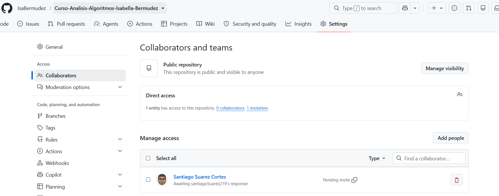

# Analisis de Algoritmos -Isabella Bermudez Arboleda

Repositorio apra eld esarrollo de los ejercicios y laboratorios del curso de Analisis de algoritmos


## Estructura del repositorio

* **benchmarks**: Pruebas de los algoritmos implementados
* **ejercicios-clases**: Ejercicios desarrollados durante la clase
* **laboratorios**: Almacena los laboratorios evaluativos del curso
* **README.md**: Documentacion del repositorio, informacion de la asignarura y plantilla para los informes
* **.gitignore**: Define los archivos y carpetas que Git no debe incluir ni versionar

## Bloque de codigo en python
```
print("Hello Algoritmos")
```
## Evidencia de invitación al docente

## Información de la asignatura

- **Estudiante**: Isabella Bermudez Arboleda
- **Correo de estudiante**: Isabellabermudez1117114@correo.itm.edu.co
- **Docente**: Santiago Suarez Cortes
- **Facultad**: Ingeniería
- **Semestre**: 2026-2
