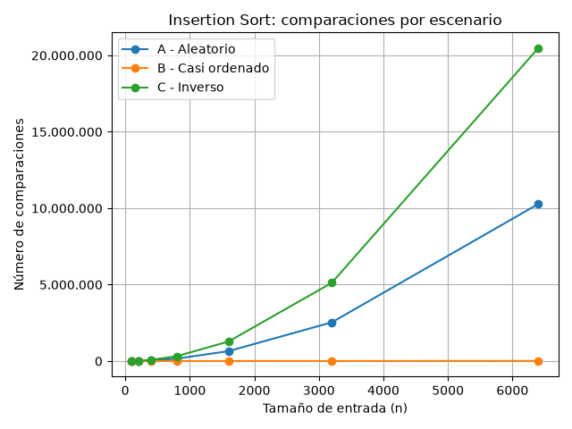
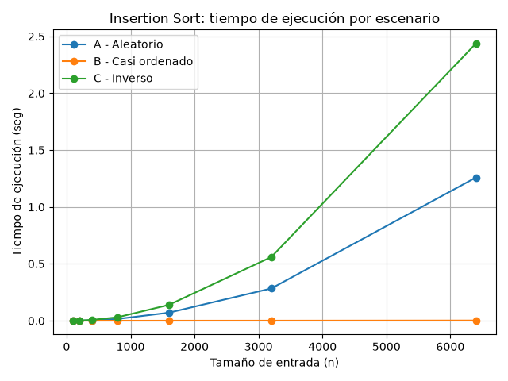
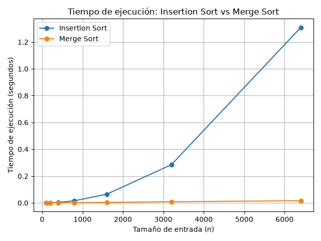

#### Isabella Bermúdez Arboleda

### Instrucciones para reproducir el experimento

Para correr este laboratorio primero hay que activar el entorno virtual que está en la raíz del repositorio. Desde la raíz del repo:

- En PowerShell: `.\venv\Scripts\Activate.ps1`

Cuando quede activado debe aparecer `(venv)` al inicio de la línea de comandos. Con eso ya se tiene matplotlib instalado (queda registrado en `requirements.txt` en la raíz), así que no hay que instalar nada más.

Luego hay que entrar a esta carpeta:

```
cd laboratorios/lab1-fundamentos-complejidad-recurrencias
```

Y desde ahí correr cada script según la parte que se quiera reproducir:

- Parte 3 (comparaciones y tiempos de Insertion Sort en los tres escenarios de Tamiza): `python parte3_casos.py`
- Parte 4 (comparación de tiempo entre Insertion Sort y Merge Sort): `python parte4_complejidad.py`

Cada script imprime los resultados directamente en la terminal y guarda las gráficas correspondientes en la carpeta `graficas/`.


### Parte 1 — Analizar el algoritmo antes de comprar hardware
Se debe analizar primero el algoritmo porque, aunque hay algoritmos que son correctos, es decir, que cumplen con la función del problema de ordenar por índice de riesgo de mayor a menor, no significa que sea el algoritmo adecuado tras el cambio de las entradas. Pues, pasó de procesar 20.000 registros hace 8 años a 1.200.000 registros en la actualidad.

Por otro lado, duplicar la velocidad del hardware no soluciona el problema de raíz ya que disminuye el tiempo del proceso a la mitad, pero también el problema nos está diciendo que aumentó los registros de hace 8 años 60 veces ahora (60*20.000=1.200.000 registros). Aquí se puede evidenciar la importancia de la elección del algoritmo; si se escoge un algoritmo cuadrático como insertion sort, el trabajo en este caso se multiplicó 60 a la 2 que da 3600 veces más trabajo que hace 8 años. Por tanto, ningún servidor con mejora de velocidad es capaz de compensar el crecimiento cuadrático con la regla de negocio o restricción que nos brinda el problema y es la ventana de cuatro horas (entre las 2:00 am y las 6:00 am) lo cual aunque el algoritmo sea correcto, no es viable.

Un ejemplo concreto es una app de compra de productos y/o comidas de supermercados y restaurantes (tipo Rappi o DidiFood) que utilicé en el quinto semestre para realizar pruebas. Este sistema contaba con alrededor de 100.000 productos registrados, en donde se implementó una búsqueda lineal iterando sobre una lista para filtrar productos por palabras clave. Ahora bien, si su respuesta no era inmediata con un usuario, al tener dos haciendo búsquedas simultáneamente, la latencia superaba los 5 segundos, lo que la hacía menos llamativa y violaba una restricción importante en este tipo de plataformas, en donde debe entregar respuestas en cuestión de pocos milisegundos, pues en estos casos es importante la experiencia del usuario.

### Parte 2 — Responsabilidad ambiental y ética de la implementación
La elección de un algoritmo no solo trae beneficios o consecuencias negativas a nivel de tiempo y rendimiento, sino que también impacta a nivel ambiental y social. Como se dijo anteriormente, una mala elección de un algoritmo hace que el proceso se finalice, pero en cuestión de horas o hasta días. Dicho lo anterior, esto no solo   incumple la restricción del tiempo, sino que también impacta en el consumo energético.
Ahora, si un servidor procesando datos a máxima capacidad consume una potencia constante de 400 W y trabaja alrededor de nueve horas con insertion sort, el consumo sería:

$$Energía\ en\ kWh = \frac{Potencia(Watts) \times tiempo\ de\ ejecución(H)}{1000}$$

$$Consumo\ en\ una\ noche = \frac{400 \times 9}{1000} = 3.6\ kWh$$

$$Consumo\ anual = 3.6\ kWh \times 365 = 1314\ kWh$$

En cambio, con merge sort el proceso puede ejecutarse en cuestión de minutos; por ejemplo, en 10 minutos (0.17 horas):

$$Consumo\ en\ una\ noche = \frac{400 \times 0.17}{1000} = 0.068\ kWh$$

$$Consumo\ anual = 0.068\ kWh \times 365 = 24.82\ kWh$$

La diferencia entre 1314 kWh y 24.82 kWh al año muestra que la elección del algoritmo no es solo una decisión de rendimiento, sino también una decisión con impacto ambiental medible a lo largo del tiempo.

Por lo cual una mala decisión en un algoritmo puede ser un gasto energético innecesario a lo largo de los años y/o durante el ciclo de vida del software. Esto se puede convertir en un verdadero problema ambiental, debido a que la generación de energía puede requerir grandes cantidades de recursos naturales como el agua y producción en exceso de emisiones de carbono.

## ¿Quién paga el costo?
Un actor que puede pagar el costo por una mala decisión de un algoritmo es el paciente con un alto índice de riesgo, el cual si el sistema no termina el proceso con el orden establecido a las 6:00 a.m. será la salud del paciente la que empeore, provocando así agravar la situación o en el peor de los casos la muerte. En la responsabilidad ética juegan dos actores fundamentales. En primer lugar, esta el operador, debido a que no debería realizar su trabajo sabiendo que el insumo que recibió no es el adecuado, ya que estaría trabajando con información que no hace referencia a la realidad de los pacientes. Por ende, existiría un costo o una responsabilidad ética por parte del operador.
Adicionalmente, tenemos otro actor, que es la secretaria, la cual debe asegurarse a que el sistema entregue la lista dentro del rango de tiempo establecido y en el orden adecuado, con el proposito de que el operador reciba el insumo correcto y pueda realizar su labor de manera adecuada.

## ¿Qué obligación adicional impone eso sobre la corrección del ordenamiento, más allá del tiempo?
Aunque el sistema cumpla con su objetivo de ordenar la lista de pacientes, también debe cumplir con uno de los factores fundamentales del problema y es realizar este proceso dentro del rango de tiempo establecido. Si no se completa antes de las 6:00 a. m. la lista que se entrega estará incompleta y no garantizará el orden correcto de prioridad.
Por esta razón, la obligación que tiene el sistema no se limita únicamente a realizar correctamente el ordenamiento, sino también a garantizar que este sea confiable y esté disponible dentro del tiempo establecido. Lo más importante según lo mencionado anteriormente, es que la decisión sobre qué algoritmo utilizar no este condicionada únicamente por solucionar el problema al instante ya que en este caso es importante encontrar un equilibrio entre los diferentes factores con los que el sistema comparte.  De esto depende que los pacientes sean contactados de acuerdo con su nivel de riesgo y que el proceso cumpla con el propósito para el cual fue diseñado.

### Parte 3 — Peor caso, mejor caso y caso promedio, demostrados en Python

Código de esta parte: [parte3_casos.py](parte3_casos.py). Este script usa la función `insertion_sort` implementada en [algoritmos.py](algoritmos.py) y los tres generadores de escenarios implementados en [datos.py](datos.py).

## 3.1 — Explicación
Peor caso: Es la entrada de tamaño fijo n en el cual el algoritmo realiza el mayor número de comparaciones y operaciones para ordenar los elementos según una condición determinada. El peor caso se puede evidenciar cuando los datos tienen un orden inverso al esperado, por lo tanto, el algoritmo tiene que mover todos los elementos llegando a la mayor cantidad de comparación y movimiento posible.

Mejor caso: Es la entrada de tamaño fijo n en el que el algoritmo realiza el mínimo numero de operaciones para ordenar los elementos. El mejor caso seria cuando los datos ya se encuentran en el orden esperado, por lo cual solo debe realizar las comparaciones necesarias y no necesita mover los elementos.

Caso promedio: Es el escenario que se obtiene al considerar las diferentes entradas  aleatorias posibles de un tamaño n y se realiza un numero promedio de comparaciones y operaciones para ordenar los datos.

# ¿cuál de los tres casos usaría para decidir si el algoritmo de Tamiza entra en producción, sabiendo que la ventana de cuatro horas es estricta, y por qué?
La mejor opción para que el algoritmo pueda entrar en producción es en el peor caso ya que la ventana tiene una restricción estricta y no negociable de cuatro horas como se menciona en el enunciado; por ello es importante tomar la entrada que tenga todas las comparaciones y operaciones sobre los datos con el objetivo de analizar si el proceso supera las cuatro horas disponibles.

# ¿Qué caso de análisis representa cada escenario de Tamiza para insertion sort? ¿Cuál es el peor caso y cuál el mejor?
El escenario A corresponde a el caso promedio debido a que las entradas/registros son aleatorios según en el tiempo que cada laboratorio lo haya subido mas no tiene un orden relacionado por el índice de riesgo que se quiere ordenar
El escenario B corresponde al mejor caso ya que el 98% del total de la lista, es decir la mayor parte de los registros vienen organizados por el índice de riesgo y solo se pretende organizar el 2% restante de los registros
El escenario C corresponde a el peor de los casos ya que los datos vienen en el orden inverso (de menor a mayor riesgo de índice) en el que deben estar organizados (de mayor a menor). Por tanto, el algoritmo debe operar sobre todos los datos para compararlos y desplazarlos.

## 3.2 — Demostración experimental





# Análisis de los resultados

Al revisar los resultados obtenidos, se puede ver que el comportamiento de los tres escenarios fue diferente, aunque en general si logramos coincidir con lo que había planteado en la predicción de la sección 3.1.

El escenario C fue el que presentó el mayor número de comparaciones en todos los tamaños (n) probados. Por ejemplo, cuando n = 6400, realizó 20.476.800 comparaciones y tardó aproximadamente 4,13 segundos. Esto tiene bastante sentido porque los datos llegan completamente en el orden contrario al que necesita el algoritmo, por lo que Insertion Sort tiene que recorrer y desplazar una gran cantidad de elementos.

Por otro lado, el escenario B fue el que tuvo el menor costo. Para n = 6400 solamente realizó 10.277 comparaciones y tardó aproximadamente 0,0028 segundos. Esto se relaciona con que el 98 % de los datos ya se encuentra ordenado, por lo que el algoritmo casi no necesita hacer comparaciones. Aunque este escenario no representa el mejor caso teórico de Insertion Sort, sí fue el mejor de los tres escenarios evaluados, representando así la concidencia en que es el mejor caso de los 3.

El escenario A quedó entre los otros dos. Para n = 6400 realizó 10.276.753 comparaciones y tuvo un tiempo de aproximadamente 2,02 segundos. Al ser un conjunto de datos aleatorio, su comportamiento fue más costoso que B, pero menor que C. Por esta razón, dentro de los escenarios planteados, A es el que más se acerca al comportamiento que podríamos asociar con un caso promedio.

Al comparar estos resultados con mi predicción inicial, se puede decir que fue acertada. Antes de realizar las pruebas había pensado que C sería el escenario más costoso, B el que necesitaría menos trabajo y A estaría en un punto intermedio. Los resultados mostraron justamente ese comportamiento.

También se puede notar algo importante en la gráfica de comparaciones: cuando aumenta el tamaño de los datos, la diferencia entre los escenarios se vuelve mucho más grande. Esto es especialmente visible entre B y C, ya que mientras B aumenta de manera mucho más lenta, C pasa de 4.950 comparaciones con 100 elementos a más de 20 millones con 6.400 elementos.

### Parte 4 — Complejidad de merge sort e insertion sort: cálculo y validación
Código de esta parte: [parte4_complejidad.py](parte4_complejidad.py). Este script usa las funciones `insertion_sort` y `merge_sort` de [algoritmos.py](algoritmos.py).
## 4.1 — Cálculo teórico

# Merge Sort

Merge Sort trabaja dividiendo el problema original en partes cada vez más pequeñas. Si tenemos una entrada de tamaño n, en cada nivel se generan dos problemas de aproximadamente n/2. Después de resolverlos, las dos partes deben combinarse y este último proceso requiere recorrer los elementos involucrados.

Por esta razón, la recurrencia que representa el algoritmo es:

T(n) = 2T(n/2) + Θ(n)

El primer término representa las dos llamadas recursivas sobre problemas de tamaño n/2, mientras que Θ(n) corresponde al trabajo realizado al combinar las dos partes.

Para resolverla utilizo el método maestro, donde la forma corresponde a:

T(n) = aT(n/b) + f(n)

En este caso se identifican los siguientes valores:

- a = 2
- b = 2
- f(n) = Θ(n)

Ahora se calcula:

n^(log_b a)

por lo que:

n^(log_2 2) = n

Al comparar este resultado con f(n) se obtiene:

f(n) = Θ(n)

y

n^(log_b a) = n

Ambos términos tienen el mismo orden de crecimiento, por lo que se cumple la condición correspondiente al caso 2 del método maestro. Al aplicar este resultado se obtiene:

T(n) = Θ(n log n)

Por lo tanto, el costo temporal de Merge Sort es Θ(n log n).

# Insertion Sort

En el caso de Insertion Sort, el comportamiento depende bastante del orden en que llegan los datos. Para analizar el peor caso, supongamos que necesitamos ordenar de mayor a menor y recibimos:

[1, 2, 3, 4, 5]

Cada nuevo elemento debe compararse con todos los elementos que ya se encuentran en la parte ordenada y, además, estos elementos deben desplazarse para dejar espacio.

La primera iteración puede realizar una comparación, la siguiente puede realizar dos, después tres y así sucesivamente. Por eso el número de comparaciones puede representarse como:

1 + 2 + 3 + ... + (n - 1)

Esta suma corresponde a:

n(n - 1) / 2

y al desarrollarla:

(n² - n) / 2

El término que domina cuando n aumenta es n², por lo que el peor caso queda como:

T(n) = Θ(n²)

Para relacionar este resultado con la implementación utilizada, se puede observar el comportamiento de sus principales instrucciones:

| Instrucción               | Ejecuciones/costo en el peor caso |
|---------------------------|-----------------------------------|
| datos.copy()              | Se copian n elementos             |
| for                       | n - 1 iteraciones                 |
| clave = copia[i]          | n - 1 veces                       |
| j = i - 1                 | n - 1 veces                       |
| comparaciones += 1        | n(n - 1) / 2 veces                |
| if copia[j] >= clave      | n(n - 1) / 2 veces                |
| copia[j + 1] = copia[j]   | n(n - 1) / 2 veces                |
| j -= 1                    | n(n - 1) / 2 veces                |
| copia[j + 1] = clave      | n - 1 veces                       |

Aunque algunas instrucciones tienen un costo constante y otras se ejecutan de forma lineal, las operaciones que se repiten n(n - 1) / 2 veces son las que terminan determinando el crecimiento. Por esto, el peor caso de Insertion Sort es cuadrático.

# Comparación de complejidades

| Algoritmo      | Mejor caso   | Caso promedio | Peor caso  |
|----------------|--------------|---------------|------------|
| Insertion Sort | Θ(n)         | Θ(n²)         | Θ(n²)      |
| Merge Sort     | Θ(n log n)   | Θ(n log n)    | Θ(n log n) |

La diferencia principal es que Insertion Sort puede aprovechar una entrada que ya se encuentre ordenada y en ese caso su comportamiento es lineal. Sin embargo, cuando debe realizar muchos desplazamientos, el número de operaciones crece cuadráticamente. Merge Sort, en cambio, conserva Θ(n log n) independientemente del caso analizado.

## 4.2 — Validación experimental



# Análisis de los resultados

Al comparar los tiempos obtenidos para los dos algoritmos, al principio la diferencia no parece ser tan grande. Esto se puede ver en los primeros tamaños, donde los tiempos de Insertion Sort y Merge Sort todavía están relativamente cerca. Sin embargo, a medida que aumenta la cantidad de datos, la diferencia empieza a ser mucho más evidente.

Para `n = 6400`, Insertion Sort tuvo un tiempo de aproximadamente 2,24 segundos, mientras que Merge Sort tardó aproximadamente 0,040 segundos. Es una diferencia bastante grande si tenemos en cuenta que ambos algoritmos recibieron los mismos datos del escenario A.

En la gráfica también se puede observar que la curva de Insertion Sort aumenta mucho más rápido que la de Merge Sort. Por ejemplo, Insertion Sort pasó de aproximadamente 0,00045 segundos con 100 elementos a más de 2 segundos con 6400 elementos. Merge Sort, en cambio, pasó de aproximadamente 0,00029 segundos a 0,040 segundos en el mismo rango.

Esto muestra que el aumento del tamaño de los datos afecta mucho más a Insertion Sort. Aunque para cantidades pequeñas los dos algoritmos pueden tener tiempos parecidos, cuando la cantidad de registros empieza a crecer la diferencia se vuelve cada vez más importante.

Para el caso de Tamiza, los resultados de esta prueba muestran que Merge Sort tiene un comportamiento más favorable frente al crecimiento de los datos. Esto es especialmente importante porque el sistema puede recibir una cantidad grande de registros y no podemos asumir que siempre van a llegar casi ordenados.

El resultado también coincide con lo calculado en la sección 4.1. Allí obtuvimos que Insertion Sort tiene una complejidad de `Θ(n²)` en el caso promedio, mientras que Merge Sort tiene `Θ(n log n)`. En las pruebas se puede observar una diferencia que va aumentando conforme crece `n`, lo cual coincide con lo esperado.

Sin embargo, lo importante para esta comparación es el comportamiento de las curvas y la diferencia que aparece cuando el tamaño de entrada aumenta.

## 4.3 — Concepto técnico a la Secretaría de Salud

Luego de las pruebas realizadas para Tamiza utilizaría Merge Sort como algoritmo de ordenamiento. La razón principal es que no podemos depender unicamente de que los registros lleguen en un orden determinado. En las pruebas de la Parte 3 se pudo ver que Insertion Sort cambia considerablemente tanto su tiempo como sus comparaciones dependiendo del orden de los datos. Por ejemplo, con `n = 6400`, el escenario B realizó solamente 10.277 comparaciones, mientras que el escenario C llegó a 20.476.800. Esto significa que si en algún momento cambia la forma en que llegan los registros, el tiempo del proceso también puede cambiar notablemente. Como el equipo no considera mantener tres implementaciones diferentes, considero más conveniente utilizar un algoritmo cuyo comportamiento sea más estable frente a estos cambios.

Esta decisión también se apoya en la comparación realizada en la Parte 4. Con 6.400 registros del escenario A, Insertion Sort tardó aproximadamente 2,24 segundos, mientras que Merge Sort tardó aproximadamente 0,040 segundos. Sin embargo, es importante destacar que la diferencia  va variar notablemente segun aumenten la cantidad de registros a lo largo del tiempo. Por lo anterior, para un sistema que actualmente trabaja con una cantidad mucho mayor de registros, el comportamiento observado en las pruebas es un punto importante para tomar la decisión.

Ahora, si llevamos estos resultados al tamaño real de Tamiza, que es de aproximadamente 1.200.000 registros, tenemos que hacer una estimación. Para Insertion Sort tomamos como referencia los 2,24 segundos obtenidos con la mayor cantidad de registros (6400) y usamos el crecimiento cuadrático obtenido en la sección 4.1. La cantidad de registros aumenta 187,5 veces, por lo que el tiempo estimado sería de aproximadamente 78.764 segundos, es decir, cerca de 21,9 horas. La proyección realizada justifica de gran manera que ese tiempo no se encuentra dentro del rango establecido para realizar el ordenamiento.

Para Merge Sort hacemos una estimación diferente, ya que su crecimiento corresponde a `n log n`. Tomando como referencia los aproximadamente 0,040 segundos obtenidos con 6.400 registros, el tiempo estimado para 1.200.000 registros sería de alrededor de 12 segundos. Este valor es una extrapolación y no significa que hayamos ejecutado el algoritmo con 1.200.000 registros en esta prueba. Lo importante es que la diferencia entre ambos crecimientos es grande y la estimación de Merge Sort queda muy por debajo de la ventana de cuatro horas.

Con el popósito de responder a la propuesta de utilizar un servidor con el doble de velocidad, considero que esto podría reducir el tiempo de ejecución, pero no resolvería el problema de fondo. Si tomamos como referencia el peor escenario medido para Insertion Sort, que tardó aproximadamente 4,13 segundos con 6.400 registros, duplicar la velocidad del servidor de forma ideal podría reducir ese tiempo aproximadamente a la mitad. Sin embargo, al extrapolar el crecimiento del algoritmo hasta los 1.200.000 registros, seguiríamos teniendo un tiempo muy superior a las cuatro horas. El problema, entonces, no es solamente que el servidor sea lento, sino la cantidad de trabajo que debe realizar el algoritmo cuando aumenta el número de registros.

Por último, también tendría en cuenta que Merge Sort necesita utilizar memoria adicional durante el proceso de división y combinación de las listas. Esto significa que antes de llevarlo a producción habría que revisar que la infraestructura tenga memoria suficiente para manejar el volumen real de Tamiza.

